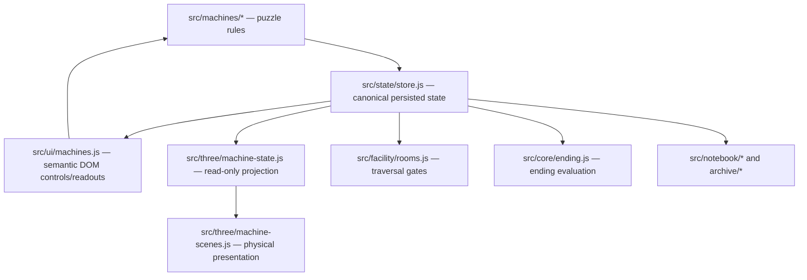

# Three.js State Contract

## Purpose

Three.js is a physical projection of the mystery, not a second gameplay engine.

The canonical game state remains owned by the existing store and machine modules. Three.js may consume read-only projections of that state and, in later phases, may request semantic actions that are routed back through existing gameplay commands. Three.js objects, transforms, materials, animations, raycasts, or scene-local flags must never become the sole authority for puzzle progress, room gating, discoveries, persistence, notebook consequences, or endings.

## Source-of-truth graph



### Authority roles

| Surface | Role | May mutate canonical gameplay state? |
| --- | --- | --- |
| `src/state/store.js` | Canonical state container + persistence | Yes, through store mutations |
| `src/machines/*.js` | Canonical machine rules/commands | Yes |
| `src/facility/rooms.js` | Canonical traversal predicates | No direct mutation; evaluates canonical state |
| `src/core/ending.js` | Canonical ending evaluation/commit path | Yes, through existing gameplay flow |
| `src/ui/machines.js` | Semantic interaction surface | Only by invoking existing commands through the store |
| `src/three/machine-state.js` | Read-only presentation projection | **Never** |
| `src/three/machine-scenes.js` | Three.js rendering and physical feedback | **Never as sole authority** |

## Protected invariants

### INV-3D-001 — Existing gameplay remains authoritative

**Precondition:** A machine action, puzzle solution, traversal check, save/load, discovery, or ending is evaluated.

**Action:** Execute the normal gameplay path with or without the Three.js enhancement available.

**Expected result:** The outcome is determined by canonical store/machine logic, not by Three.js scene-local state.

**Proof:** Existing core QA and browser QA pass with the 3D enhancement enabled and with its WebGL fallback active.

### INV-3D-002 — Projection is read-only

**Precondition:** A canonical game state object is provided to `projectMachineState()` or a machine-specific projector.

**Action:** Produce presentation state.

**Expected result:** The canonical state object is unchanged and the returned projection is immutable.

**Proof:** `qa/machine-state.mjs`.

### INV-3D-003 — 3D failure is non-fatal

**Precondition:** Three.js loads but WebGL is unavailable, or the 3D rendering path cannot initialize.

**Action:** Enter a machine room.

**Expected result:** Existing semantic controls remain available and usable; the 3D region reports an explicit unavailable state.

**Proof:** `qa/three-runtime.mjs` plus browser QA.

### INV-3D-004 — One renderer/loop owner

**Precondition:** The player traverses between machine rooms.

**Action:** Mount and unmount Three.js presentations.

**Expected result:** The managed Three.js runtime retains one renderer path and one animation-loop owner; machine scenes do not start independent RAF loops.

**Proof:** Runtime source inspection now; repeated lifecycle measurement will become mandatory before the full facility phase.

### INV-3D-005 — Hidden puzzle rules are never reimplemented in Three.js

When canonical machine code computes a derived value, recognition result, or secret rule, the 3D layer consumes only the resulting canonical state. It may not reproduce hidden formulas merely to animate the same concept. ORACLE's significance formula is the reference case.

### INV-3D-006 — Secret content does not cross the renderer boundary

When puzzle progress includes secret text or ordered symbols, Three.js receives anonymous progress or boolean consequences only. VERBOTEN printed words/capture keys and SUNDIAL glyph/access-code content are the reference cases. Focused tests must prove those literals are absent from the projection object.

## DEIMOS reference projection

`projectDeimosState(state)` is the first reference adapter.

Canonical inputs:
- `state.machines.deimos.orientation`
- `state.machines.deimos.safeOpen`

Derived presentation outputs:
- `orientationIndex` — bounded to `0..7`
- `orientationRadians` — physical orientation in 45-degree increments
- `triggerAligned` — true at canonical orientation index `5` (CEILING)
- `safeOpen` — persistent canonical safe-open state
- `phase` — `dormant`, `engaged`, or `aftermath`

Important distinction: `triggerAligned` means the current orientation is the one that can open the safe. `safeOpen` means the canonical puzzle state records that the safe has already opened. The 3D safe therefore remains physically open after discovery even if orientation later changes.

## CHRONOSTAT reference projection

`projectChronostatState(state)` is the second state-driven adapter.

Canonical inputs:
- `state.machines.chronostat.sent`
- `state.machines.chronostat.inbox`
- `state.machines.chronostat.roundTrips`
- `state.machines.chronostat.shift`
- `state.machines.chronostat.unlockedVerb`

Derived presentation outputs:
- `sentCount`, `inboxCount`, `waitingForReply`
- bounded `roundTrips` and `shift`
- `phaseOffsetRadians`, `signalStrength`, `drift`
- `unlockedVerb`
- `phase`

Physical interpretation:
- a reply in flight quantizes pendulum and phase-ring motion;
- the telegraph key visibly depresses while canonical state indicates a reply is outstanding;
- completed round trips progressively light six physical markers;
- canonical shift rotates the phase assembly through seven positions;
- temporal echo pendulums become visible as the loop accumulates history;
- the final canonical Verboten unlock stabilizes the machine.

The projection deliberately does **not** reveal future-message text.

## ATLAS reference projection

`projectAtlasState(state)` is the third state-driven adapter. The canonical shape-recognition heuristic remains entirely in `src/machines/atlas.js`.

Canonical inputs:
- `state.machines.atlas.strokes`
- `state.machines.atlas.lockedShapes`
- `state.machines.atlas.openedSundial`

Derived presentation outputs:
- `strokeCount`, `draftStrokeCount`, `lockedStrokeCount`, `lockedShapeCount`
- `latestLockedPath` — immutable normalized sample of at most 48 points
- `topologyStrength`
- `openedSundial`
- `phase`

Physical interpretation:
- the latest locked player stroke wraps onto the globe as a false coastline/topological scar;
- locked-shape progress activates incompatible topology rings;
- draft activity affects a survey marker without making draft geometry permanent;
- canonical Sundial unlock stabilizes the apparatus.

Three.js never evaluates whether a stroke qualifies for the Sundial.

## ARCHIVE reference projection

`projectArchiveState(state)` is the fourth state-driven adapter. It deliberately separates identity revelation from puzzle solution because canonical state does not persist the player's current drag order.

Canonical inputs:
- `state.machines.archive.revealed`
- `state.machines.archive.solved`

Derived presentation outputs:
- immutable de-duplicated `revealedIds`
- `revealedCount`, `allRevealed`, `completion`
- `solved`
- `phase`

Physical interpretation:
- six anonymous drawers emerge as identities are canonically revealed;
- pre-solve cabinet geometry remains deliberately irregular;
- all six drawers can be visible while unresolved;
- only canonical `solved=true` closes, aligns, and stabilizes the cabinet.

The 3D scene never stores, guesses, or reconstructs transient drag order.

## ORACLE reference projection

`projectOracleState(state)` is the fifth state-driven adapter. ORACLE establishes a stricter derived-state rule: the hidden significance calculation remains exclusively in `src/machines/oracle.js`. Three.js consumes only values that canonical gameplay has already persisted.

Canonical inputs:
- `state.machines.oracle.placed`
- `state.machines.oracle.readings`
- `state.discoveries.oracle_inverse`
- `state.discoveries.oracle_significance`
- `state.machines.oracle.openedDirector`

Derived presentation outputs:
- immutable unique known `placedIds`
- immutable `readingEntries` containing only stored finite reading values plus bounded presentation normalization/polarity
- `placedCount`, `readingCount`, positive/negative/zero reading counts
- `balanceSignal` derived from the already-stored readings, bounded to presentation range
- `inverseObserved`, `ruleLearned`, `openedDirector`
- `phase`

Physical interpretation:
- the balance beam tilts from stored reading consequences, not from token true masses or significance scores;
- placed-token markers float according to already-computed reading magnitude/polarity;
- zero-reading objects visibly hover rather than pretending to have ordinary weight;
- inverse-weight discovery exposes an oxide halo;
- learning the significance rule changes the apparatus state without revealing the formula;
- canonical Director unlock stabilizes the scale and shifts the apparatus to green aftermath.

Forbidden duplication:
- no `SIGNIFICANCE` table in Three.js;
- no true-mass table in Three.js;
- no recreation of the canonical reading formula in Three.js;
- no inference that a token should unlock the Director independent of canonical `openedDirector`.

This keeps the renderer capable of dramatizing the consequences of the Oracle while structurally unable to become a parallel implementation of its secret rule.


## VERBOTEN reference projection

`projectVerbotenState(state)` is the sixth state-driven adapter. VERBOTEN establishes a strict content-boundary rule: the 3D layer may know how much printing and witnessing has occurred, but it never receives the printed words, capture keys, staff names, or ledger order.

Canonical inputs:
- `state.machines.verboten.wordsPrinted` length only
- `state.machines.verboten.captures` finite-entry count only
- `state.machines.verboten.openedDirector`

Derived presentation outputs:
- bounded `printedCount` and `capturedCount`
- `printCompletion` and `captureDensity`
- `spent`
- `openedDirector`
- `phase`

Physical interpretation:
- spool, tape, furnace heat, and twelve anonymous print markers react to print progress;
- anonymous witness markers and containment compression react to capture progress;
- the renderer cannot display the ledger because no word value or capture key crosses the projector boundary;
- canonical Director unlock stabilizes the machine into green aftermath.

Forbidden leakage:
- no `wordsPrinted[].word` values in the projection;
- no capture object keys in the projection;
- no staff-name table or ledger-order copy in Three.js;
- no renderer-side inference of Director unlock.

## SUNDIAL reference projection

`projectSundialState(state)` is the seventh state-driven adapter. It projects retrograde time and anonymous access-progress consequences while keeping the seven glyph characters and assembled access-code string entirely inside canonical gameplay state.

Canonical inputs:
- `state.machines.sundial.hour`
- `state.machines.sundial.glyphs` length only
- existence of `state.machines.sundial.accessCode` as a boolean ready state only
- `state.discoveries.sundial_reversal`
- `state.machines.sundial.used`

Derived presentation outputs:
- bounded `hour` and `shadowAngleRadians`
- bounded `glyphCount` and `glyphCompletion`
- `codeReady`
- `reversalObserved`
- `used`
- `phase`

Physical interpretation:
- a 24-position dial and shadow pivot express the canonical retrograde hour;
- seven anonymous apertures illuminate as glyph progress is earned;
- reversal discovery exposes a ghosted counter-shadow without showing any character;
- completed code state activates a central iris without exposing the code;
- successful canonical code use stabilizes the whole apparatus into green aftermath.

Forbidden leakage:
- no glyph array in the projection;
- no glyph character in the renderer;
- no access-code string in the projection or DOM dataset;
- no renderer-side code validation.

The seven-machine projection layer is now complete. Any later 3D interaction must preserve the same one-way authority rule and route semantic actions back through existing machine/store commands.

## Future machine adapters

Every future machine must follow:

```text
canonical state
    ↓
read-only projector
    ↓
physical Three.js state
```

Future 3D interaction must route back through a semantic command:

```text
3D hit target
    ↓
semantic action request
    ↓
existing machine/store command
    ↓
canonical state change
    ↓
read-only projection
    ↓
updated Three.js presentation
```

Direct mutation of puzzle truth from mesh transforms, materials, animation state, or raycast-local flags is prohibited.

## Validation gate for every new machine projection

A machine projection is not complete until:
1. the projector has focused tests;
2. canonical state is proven unchanged by projection;
3. existing core QA passes;
4. existing browser QA passes;
5. Three.js fallback QA passes if the runtime path changed;
6. the real GPU path remains explicitly unverified until observed in a real WebGL browser.
