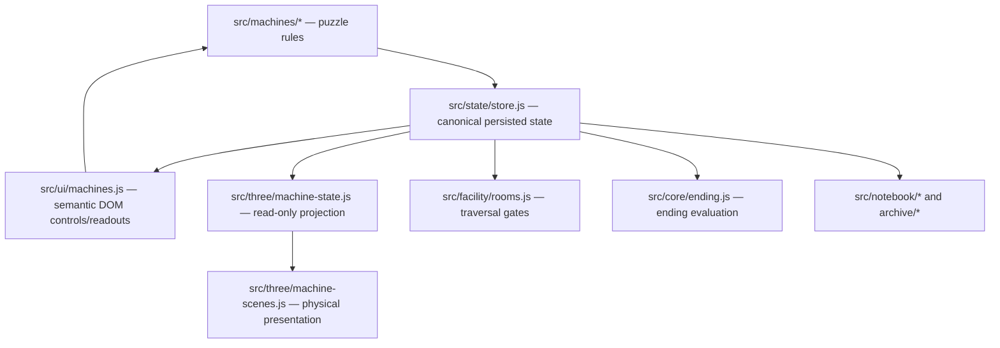

# Three.js State Contract

## Purpose

Three.js is a physical projection of the mystery, not a second gameplay engine.

The canonical game state remains owned by the existing store and machine modules. Three.js may consume read-only projections of that state and, in later phases, may request semantic actions that are routed back through existing gameplay commands. Three.js objects, transforms, materials, animations, raycasts, or scene-local flags must never become the sole authority for puzzle progress, room gating, discoveries, persistence, notebook consequences, or endings.

## Source-of-truth graph



### Authority roles

| Surface | Role | May mutate canonical gameplay state? |
| --- | --- | --- |
| `src/state/store.js` | Canonical state container + persistence | Yes, through store mutations |
| `src/machines/*.js` | Canonical machine rules/commands | Yes |
| `src/facility/rooms.js` | Canonical traversal predicates | No direct mutation; evaluates canonical state |
| `src/core/ending.js` | Canonical ending evaluation/commit path | Yes, through existing gameplay flow |
| `src/ui/machines.js` | Semantic interaction surface | Only by invoking existing commands through the store |
| `src/three/machine-state.js` | Read-only presentation projection | **Never** |
| `src/three/machine-scenes.js` | Three.js rendering and physical feedback | **Never as sole authority** |

## Protected invariants

### INV-3D-001 — Existing gameplay remains authoritative

**Precondition:** A machine action, puzzle solution, traversal check, save/load, discovery, or ending is evaluated.

**Action:** Execute the normal gameplay path with or without the Three.js enhancement available.

**Expected result:** The outcome is determined by canonical store/machine logic, not by Three.js scene-local state.

**Proof:** Existing core QA and browser QA pass with the 3D enhancement enabled and with its WebGL fallback active.

### INV-3D-002 — Projection is read-only

**Precondition:** A canonical game state object is provided to `projectMachineState()` or a machine-specific projector.

**Action:** Produce presentation state.

**Expected result:** The canonical state object is unchanged and the returned projection is immutable.

**Proof:** `qa/machine-state.mjs`.

### INV-3D-003 — 3D failure is non-fatal

**Precondition:** Three.js loads but WebGL is unavailable, or the 3D rendering path cannot initialize.

**Action:** Enter a machine room.

**Expected result:** Existing semantic controls remain available and usable; the 3D region reports an explicit unavailable state.

**Proof:** `qa/three-runtime.mjs` plus browser QA.

### INV-3D-004 — One renderer/loop owner

**Precondition:** The player traverses between machine rooms.

**Action:** Mount and unmount Three.js presentations.

**Expected result:** The managed Three.js runtime retains one renderer path and one animation-loop owner; machine scenes do not start independent RAF loops.

**Proof:** Runtime source inspection now; repeated lifecycle measurement will become mandatory before the full facility phase.

## DEIMOS reference projection

`projectDeimosState(state)` is the first reference adapter.

Canonical inputs:

- `state.machines.deimos.orientation`
- `state.machines.deimos.safeOpen`

Derived presentation outputs:

- `orientationIndex` — bounded to `0..7`
- `orientationRadians` — physical orientation in 45-degree increments
- `triggerAligned` — true at canonical orientation index `5` (CEILING)
- `safeOpen` — persistent canonical safe-open state
- `phase` — `dormant`, `engaged`, or `aftermath`

Important distinction: `triggerAligned` means the current orientation is the one that can open the safe. `safeOpen` means the canonical puzzle state records that the safe has already opened. The 3D safe should therefore remain physically open after discovery even if the chamber orientation later changes.

## Future machine adapters

Every future machine must follow the same direction:

```text
canonical state
    ↓
read-only projector
    ↓
physical Three.js state
```

When 3D interaction is added later, it must route back through a semantic command:

```text
3D hit target
    ↓
semantic action request
    ↓
existing machine/store command
    ↓
canonical state change
    ↓
read-only projection
    ↓
updated Three.js presentation
```

Direct mutation of puzzle truth from mesh transforms, materials, animation state, or raycast-local flags is prohibited.

## Validation gate for every new machine projection

A machine projection is not complete until:

1. the projector has focused tests;
2. canonical state is proven unchanged by projection;
3. existing core QA passes;
4. existing browser QA passes;
5. Three.js fallback QA passes if the runtime path changed;
6. the real GPU path remains explicitly unverified until observed in a real WebGL browser.
